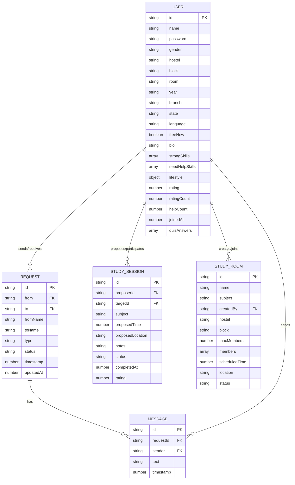

# TABLE OF CONTENTS

1. [INTRODUCTION](#1-introduction)
   - [ABOUT THE DOMAIN](#about-the-domain)
   - [ABOUT THE PROJECT](#about-the-project)
   - [OBJECTIVES](#objectives)
2. [PROBLEM DEFINITION](#2-problem-definition)
   - [EXISTING SYSTEM](#existing-system)
   - [PROPOSED SYSTEM](#proposed-system)
   - [ADVANTAGES OF PROPOSED SYSTEM](#advantages-of-proposed-system)
3. [REQUIREMENT ANALYSIS](#3-requirement-analysis)
   - [HARDWARE REQUIREMENTS](#hardware-requirements)
   - [SOFTWARE REQUIREMENTS](#software-requirements)
   - [FUNCTIONAL REQUIREMENTS](#functional-requirements)
4. [SYSTEM DESIGN](#4-system-design)
   - [ARCHITECTURE DIAGRAM](#architecture-diagram)
   - [USE CASE DIAGRAM](#use-case-diagram)
   - [ER DIAGRAM / CLASS DIAGRAM](#er-diagram--class-diagram)
   - [DATABASE DESIGN](#database-design)
5. [IMPLEMENTATION](#5-implementation)
   - [MODULES DESCRIPTION](#modules-description)
   - [SAMPLE SCREENS](#sample-screens)
   - [IMPORTANT CODE SNIPPETS](#important-code-snippets)
6. [TESTING](#6-testing)
   - [TEST CASES](#test-cases)
   - [OUTPUT VERIFICATION](#output-verification)
7. [CONCLUSION & FUTURE ENHANCEMENTS](#7-conclusion--future-enhancements)
   - [BIBLIOGRAPHY](#bibliography)
   - [APPENDIX A - SCREEN SHOTS](#appendix-a---screen-shots)
   - [APPENDIX B - TABLES](#appendix-b---tables)
   - [APPENDIX C - SAMPLE CODING](#appendix-c---sample-coding)

---

# 1. INTRODUCTION

## ABOUT THE DOMAIN
In modern academic institutions, hostels serve as the primary residence for thousands of students who come from different states, backgrounds, and academic disciplines. While physical proximity creates an opportunity for collaboration, the sheer size and diversity of hostel communities makes it extremely difficult for individual students to identify peers who share their academic needs, study habits, or lifestyle preferences.

## ABOUT THE PROJECT
**INAI (Intelligent Network for Academic Integration)** is a purpose-built web application that solves this problem by providing intelligent, algorithm-driven matching between hostel students. The name "INAI" is inspired by the Tamil word *இணை* (iṇai), meaning "to connect" or "to link", reflecting the system's core purpose of creating meaningful academic connections.

The system operates as a full-stack web application:
- The **front-end** is built with pure HTML5, CSS3, and vanilla JavaScript.
- The **back-end** is powered by Node.js and Express.js, providing a RESTful API secured with JWT-style token authentication.
- The **database** uses MongoDB Atlas, a cloud-hosted NoSQL database.

## OBJECTIVES
The primary objectives of the INAI system are:
1. **To enable intelligent study partner matching** — using a multi-factor scoring algorithm.
2. **To provide a hostel-scoped room map** — allowing students to visually see who lives in their hostel block by block.
3. **To facilitate roommate finding** — matching students based on lifestyle compatibility.
4. **To support group study coordination** — through Study Rooms.
5. **To enable privacy-safe connections** — names and room numbers remain hidden until both parties establish a mutual connection.
6. **To provide a productivity tool** — a built-in Pomodoro focus timer with a brain break mini-game.
7. **To maintain gender-safe boundaries** — matching and map features are automatically scoped to the student's own gender hostel.

# 2. PROBLEM DEFINITION
Hostel students face the following recurring problems:
1. **No structured way to find study partners** — relying on informal WhatsApp groups or random encounters.
2. **Roommate incompatibility** — assigned to share rooms with incompatible sleep schedules or study habits.
3. **Lack of hostel community visibility** — not knowing who their neighbours are or which subjects they can help with.
4. **Privacy concerns** — sharing personal room numbers publicly is a safety risk.
5. **No centralized coordination tool** — study sessions are scheduled over multiple apps with no accountability.

## EXISTING SYSTEM
Currently, the following informal methods exist:
- **WhatsApp Groups** — Subject-wise groups exist but have no matching algorithm, no profile system, and no privacy control.
- **Notice Boards** — Physical hostel notice boards for room-sharing requests are slow and only visible to nearby residents.
- **Word of Mouth** — Students rely on friends to introduce compatible peers, limiting the reach to small social circles.

**Drawbacks of Existing Systems:**
- No algorithmic matching.
- No gender-safety enforcement.
- No room privacy controls.
- No integrated session scheduling or rating.

## PROPOSED SYSTEM
The **INAI** system proposes a comprehensive, algorithm-driven web platform with the following capabilities:
- **Profile-based registration** capturing hostel, block, room, academic skills, lifestyle, and availability.
- **Three-tier matching engine:** Quick Match, Preference Match, and Roommate Match.
- **Gender-safe architecture:** All matching and the hostel map are automatically filtered.
- **Privacy-first connection model:** Anonymized until mutual connection.
- **Hostel Map** with floor-based room grid.
- **Study Session scheduling** and **Group Study Rooms**.

## ADVANTAGES OF PROPOSED SYSTEM
1. **Intelligent Matching**: Multi-factor algorithm scores peers across 5 dimensions.
2. **Gender-Safe**: Hostel map and matches automatically scoped to own hostel.
3. **Privacy-First**: Names and rooms hidden until mutual connection.
4. **Hostel-Aware**: All features work at block and room granularity.
5. **Integrated**: Match, connect, schedule, chat — all in one platform.
6. **No App Install**: Pure web app — works in any browser.
7. **Real-time Updates**: Background polling for request badges and notifications.

# 3. REQUIREMENT ANALYSIS

## HARDWARE REQUIREMENTS
| Component | Recommended |
|---|---|
| **Processor** | Intel Core i5 / Ryzen 5 |
| **RAM** | 8 GB |
| **Storage** | 2 GB free space |
| **Network** | 10 Mbps |
| **Display** | 1366×768 or higher |

## SOFTWARE REQUIREMENTS
| Category | Tool / Technology |
|---|---|
| **Operating System** | Windows 10/11 |
| **Runtime** | Node.js v18+ |
| **Backend Framework** | Express.js v5.x |
| **Database** | MongoDB Atlas (cloud) v7.x |
| **Front-end** | HTML5, CSS3, Vanilla JavaScript |
| **IDE** | Visual Studio Code 1.90+ |

## FUNCTIONAL REQUIREMENTS
1. Students shall register with hostel, block, room, branch, year, state, skills, and lifestyle.
2. Students shall log in with name and password.
3. System shall match students using Quick Match, Preference Match, and Roommate Match.
4. All matches shall be filtered to same gender only by default.
5. Hostel Map shall show only the student's own hostel.
6. Students shall send, accept or decline study or roommate requests.
7. On acceptance, room number shall be revealed to both parties.
8. Connected students shall be able to chat in real time.
9. Students shall create and join group study rooms (max 10 members).
10. Admin shall view all users, requests, and system statistics.

# 4. SYSTEM DESIGN

## ARCHITECTURE DIAGRAM
The INAI system follows a **3-Tier Client-Server Architecture**:
- **Presentation Tier (Client)**: HTML5 Pages and Vanilla JS Modules.
- **Application Tier (Server)**: Node.js + Express.js API, handling Auth and Rate Limiting.
- **Data Tier (Database)**: MongoDB Atlas (Cloud) Collections: users, requests, messages, studysessions, studyrooms.

*(Insert Architecture Diagram here)*

## USE CASE DIAGRAM
**Student Use Cases**:
Register, Login, View Dashboard, Toggle Free Now, Find Match, View Hostel Map, Send/Accept Requests, Chat, Schedule Study Sessions, Create/Join Study Rooms.
**Admin Use Cases**:
Login, View All Users, Delete User, View System Statistics, View All Requests.

*(Insert Use Case Diagram here)*

## ER DIAGRAM / CLASS DIAGRAM
- **USER**: id (PK), name, password, gender, hostel, block, room, skills, etc.
- **REQUEST**: id (PK), from (FK), to (FK), type, status.
- **STUDY SESSION**: id (PK), proposerId (FK), targetId (FK), subject, time, status.
- **STUDY ROOM**: id (PK), createdBy (FK), subject, members[].



## DATABASE DESIGN
1. **Users Collection**: Stores user profile, credentials, and matching criteria.
2. **Requests Collection**: Manages connection lifecycle (pending, accepted, declined).
3. **Study Sessions Collection**: Records 1-on-1 scheduled sessions.
4. **Study Rooms Collection**: Manages active group study rooms.

# 5. IMPLEMENTATION

## MODULES DESCRIPTION
- **Authentication**: Register, Login, Token management.
- **Data Layer**: API calls, CRUD helpers, cache management.
- **Matching Engine**: Quick Match, Preference Match algorithms.
- **Request System**: Send/accept/decline requests.
- **Hostel Map**: Visual room-level map of own hostel.
- **Study Rooms / Sessions**: Propose and manage study activities.
- **Admin Panel**: User management, statistics.

## SAMPLE SCREENS
- **Dashboard**: Shows connection network graph, Pomodoro timer, stats.
- **Match Page**: Quick Match and Preference Match tabs with filterable cards.
- **Hostel Map**: Grid of rooms by block, showing real-time availability.

*(See Appendix A for Screenshots)*

## IMPORTANT CODE SNIPPETS
### Matching Algorithm Example
```javascript
function calculateScore(currentUser, otherUser, sameGenderOnly = true) {
  if (sameGenderOnly && currentUser.gender !== otherUser.gender) return { score: 0 };
  let score = 0;
  if (otherUser.sameBlock && otherUser.sameHostel) score += 40;
  else if (otherUser.sameHostel) score += 20;
  return { score };
}
```

# 6. TESTING

## TEST CASES
- **TC-A01**: Register with valid data -> Account created, token returned.
- **TC-A02**: Register with duplicate name -> Error: "Name already registered".
- **TC-M01**: Quick Match (male user) -> Only male students shown.
- **TC-R01**: Send request to unconnected user -> Request saved, button changes to "Request Sent".
- **TC-R03**: Accept incoming request -> Status changes to accepted, room revealed.
- **TC-R05**: Name hidden before connection -> "Anonymous Student" shown.

## OUTPUT VERIFICATION
1. **Matching Accuracy:** The algorithm correctly scores and ranks students.
2. **Privacy Enforcement:** Names and room numbers remained hidden until connection accepted.
3. **Gender Safety:** Male users see only male students, female users see only female students.
4. **Hostel Map Accuracy:** Renders only the logged-in student's hostel.

# 7. CONCLUSION & FUTURE ENHANCEMENTS
The **INAI** project successfully demonstrates the power of a well-designed web application in solving real-world problems faced by hostel students. By combining a multi-factor matching algorithm with a privacy-first connection model, INAI creates a safe, efficient, and enjoyable academic community experience.

**Future Enhancements**:
1. WebSocket Integration for real-time chat and live map updates.
2. Mobile App (Progressive Web App) with push notifications.
3. Hostel Authority Integration for verified room assignments.
4. Group Chat for Study Rooms.
5. AI-Powered Quiz Matching.

## BIBLIOGRAPHY
1. Flanagan, D. (2020). *JavaScript: The Definitive Guide*. O'Reilly Media.
2. Brown, E. (2019). *Web Development with Node and Express*. O'Reilly Media.
3. MDN Web Docs (HTML, CSS, JavaScript) — https://developer.mozilla.org
4. MongoDB Atlas Documentation — https://www.mongodb.com/docs/atlas/

## APPENDIX A - SCREEN SHOTS
*(Include screenshots of Dashboard, Matching, Hostel Map, etc.)*

## APPENDIX B - TABLES
*(Include any supplementary data tables, test results matrices)*

## APPENDIX C - SAMPLE CODING
*(Include full source code listings for server.js, match.js, etc.)*
